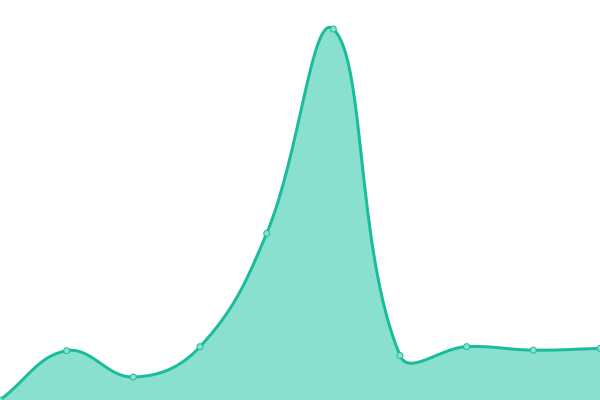
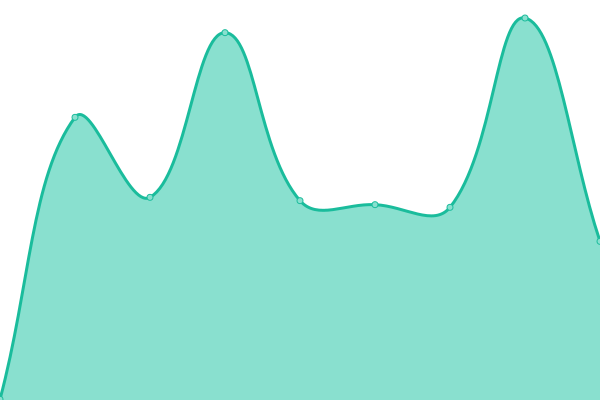

# [📈 Live Status](https://mananchawla2005.github.io/upptime): <!--live status--> **🟧 Partial outage**

This repository contains the open-source uptime monitor and status page for [Manan Chawla](https://mananchawla.ml), powered by [Upptime](https://github.com/upptime/upptime).

With [Upptime](https://upptime.js.org), you can get your own unlimited and free uptime monitor and status page, powered entirely by a GitHub repository. We use [Issues](https://github.com/mananchawla2005/upptime/issues) as incident reports, [Actions](https://github.com/mananchawla2005/upptime/actions) as uptime monitors, and [Pages](https://mananchawla2005.github.io/upptime) for the status page.

<!--start: status pages-->
<!-- This summary is generated by Upptime (https://github.com/upptime/upptime) -->
<!-- Do not edit this manually, your changes will be overwritten -->
<!-- prettier-ignore -->
| URL | Status | History | Response Time | Uptime |
| --- | ------ | ------- | ------------- | ------ |
|  [Url Shortner](https://www.usrt.cf/) | 🟩 Up | [url-shortner.yml](https://github.com/mananchawla2005/upptime/commits/HEAD/history/url-shortner.yml) | 

 1580ms
     
 | 

<a href="https://status.mananchawla.ml/history/url-shortner">100.00%</a>
    

|  [Tindog](https://tindog.mananchawla2005.repl.co/) | 🟩 Up | [tindog.yml](https://github.com/mananchawla2005/upptime/commits/HEAD/history/tindog.yml) | 

 450ms
     
 | 

<a href="https://status.mananchawla.ml/history/tindog">100.00%</a>
    

|  [Portfolio](https://mananchawla.ml/index) | 🟥 Down | [portfolio.yml](https://github.com/mananchawla2005/upptime/commits/HEAD/history/portfolio.yml) | 

 461ms
     
 | 

<a href="https://status.mananchawla.ml/history/portfolio">94.13%</a>
    

|  [Blog](https://blog.mananchawla.ml/) | 🟩 Up | [blog.yml](https://github.com/mananchawla2005/upptime/commits/HEAD/history/blog.yml) | 

 391ms
     
 | 

<a href="https://status.mananchawla.ml/history/blog">100.00%</a>
    

<!--end: status pages-->

[**Visit our status website →**](https://mananchawla2005.github.io/upptime)

## 📄 License

- Powered by: [Upptime](https://github.com/upptime/upptime)
- Code: [MIT](./LICENSE) © [Manan Chawla](https://mananchawla.ml)
- Data in the `./history` directory: [Open Database License](https://opendatacommons.org/licenses/odbl/1-0/)
